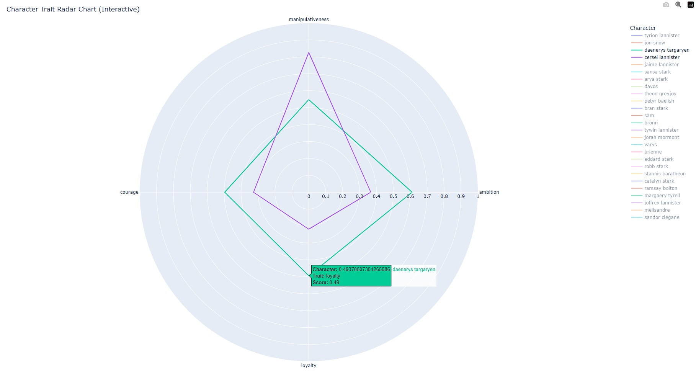
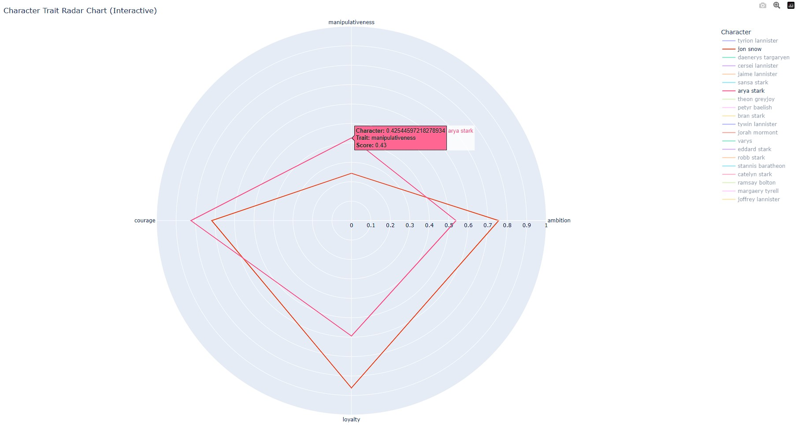
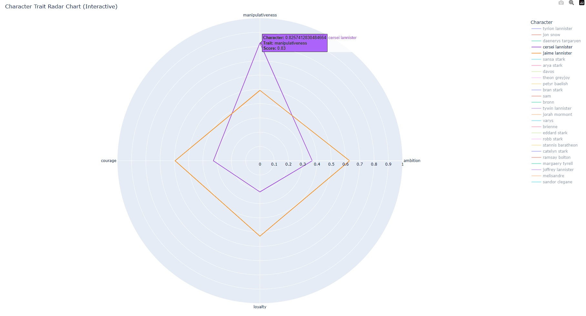

# PersonaProfiler: AI-Powered Character Analysis

PersonaProfiler is an advanced AI-powered tool designed to extract personality traits from character dialogues and match user personalities with iconic characters. Using state-of-the-art Natural Language Processing (NLP) models, the project offers seamless character analysis and personality mapping.

## Features
- **Dialogue Analysis**: Extract personality traits like humor, empathy, ambition, quirkiness, and romanticism from large datasets.
- **Batch Processing**: Efficient handling of large datasets using optimized sentiment analysis and zero-shot classification pipelines.
- **Personality Matching**: Compare user inputs to character profiles to find the closest personality match.
- **Scalable Design**: Capable of analyzing 200K+ records while maintaining performance efficiency.

## Dataset
This project uses the *Game of Thrones Script (All Seasons)* dataset from Kaggle - **[https://www.kaggle.com/datasets/albenft/game-of-thrones-script-all-seasons](#)**.
The dataset contains dialogues from all seasons of the series and serves as the foundation for personality analysis.

## Technologies Used
- **Programming Languages**: Python
- **Libraries & Tools**:
  - Hugging Face Transformers
  - Pandas
  - Torch
  - Scipy
  - Flask *(for backend API & web interface)*
- **Deployment**:
  - **Render** *(used for deploying the Flask app)*
- **Models**: Sentiment Analysis and Zero-Shot Classification from Hugging Face

## How It Works
1. **Data Processing**: Cleaned and preprocessed dialogue data from the dataset. Kept only the character name and the corresponding dialogues in all the eight seasons.
2. **Trait Extraction**: Leverages zero-shot classification and extracted below personality traits.
   - *Ambition*
   - *Loyalty*
   - *Courage*
   - *Manipulativeness*
3. **Normalization**: Normalizes trait scores for accurate comparison across characters.
4. **Personality Matching**: Matches user traits with character profiles using cosine similarity. Each personality trait have five questions assigned with scores for each option. Normalized the user responses as well for correct character matching.

## Deployment
The **PersonaProfiler** application is deployed on **Render** using Flask.  
- Visit the live application: **[https://game-of-thrones-personality-test.onrender.com/](#)**

## Debugging Tools Used  
During development and debugging, the following AI tools were used:  
- **GPT-4**, **DeepSeek**, and **Claude** for troubleshooting and improving model accuracy.

## Results

- Character personality profiles are saved in a JSON file (`char_profiles.json`).
- Normalized profiles ensure consistent and comparable trait scores.
- User personality inputs are matched with the closest character profile.

### Dialogue Proportion by Characters
Below is a pie chart illustrating the proportion of dialogues by different characters in the dataset:

### Accuracy Comparison with Character Profiles
The following images compare user personality inputs with iconic Game of Thrones characters to demonstrate accuracy:

1. Cercei vs Danaerys
   
     

3. Arya vs Jon
   
     

4. Cercei vs Jaime

    

For more comparisons, visit: https://got-character-comparision.netlify.app/

These visualizations highlight how closely user traits align with specific character profiles.

## Contributing
Contributions are welcome! Feel free to fork this repository and submit pull requests with enhancements or fixes.
